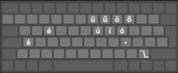

## Keylayout

#### About
The `en_hu.keylaout` was made by me with [ukelele](https://software.sil.org/ukelele/) unicode keyboard layout editor software.  
With this keyboard layout you can use the ABC (english) keyboard layout and also be able to write all letters of the Hungarian alphabet.  
#### Usage
Press the ⌥ (option/alt) modifier key and press a character go get it's accentuated letter.
* The ü,ű,ö,ő letters are above the u,o keys.  
* There are two extra ⌥ keys
 * the list dot `•` character on the `l` key
 * the shrug emoticon `¯\_(ツ)_/¯` string on the `/` key.

  

#### Credits
* Thanks to my Dad for the idea! He's been using this layout since I was a kid.
