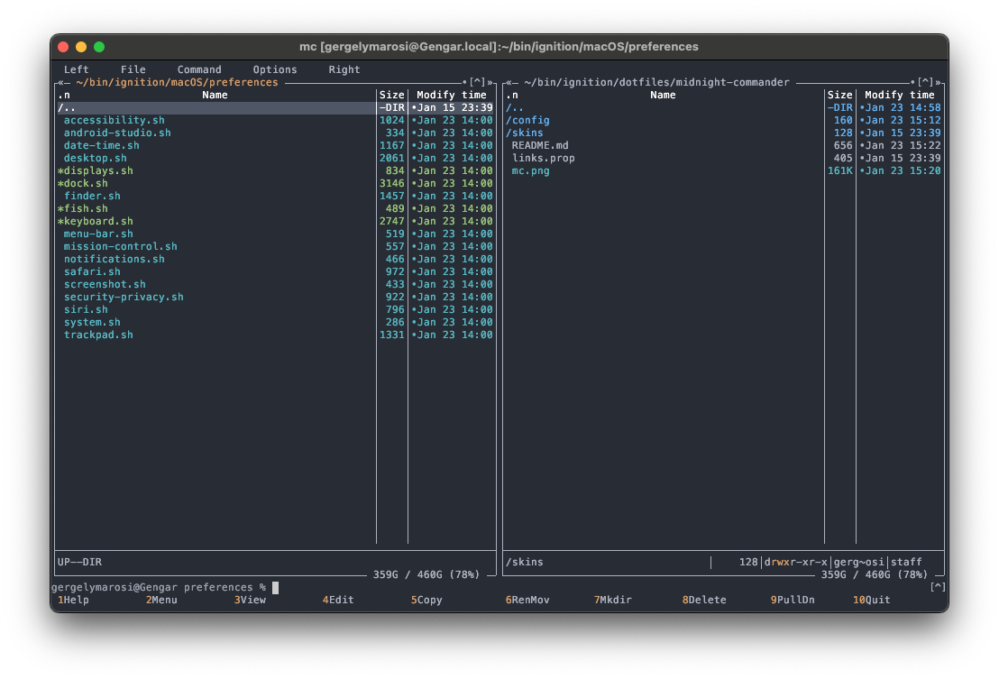

## Midnight Commander

#### Navigation
* Enter a library with the right arrow.
* Go up from a library with the left arrow.

#### Theme
I use the One Dark theme like everywhere it's possible.  
There are two available OneDark themes:  
* `onedark.ini` is for all shells (e.g. macOS Terminal)
* `onedark16M.ini` is for truecolor shells.(e.g. kitty)  

I modified the `onedark.ini` so that the colors resemble the `onedark16M.ini` more closely.
```
directory: blue -> brightblue
device: brightmagenta -> magenta
archive: magenta -> brightmagenta
```

  

#### Credits
* [OneDark theme](https://github.com/DeadNews/mc-onedark/)
